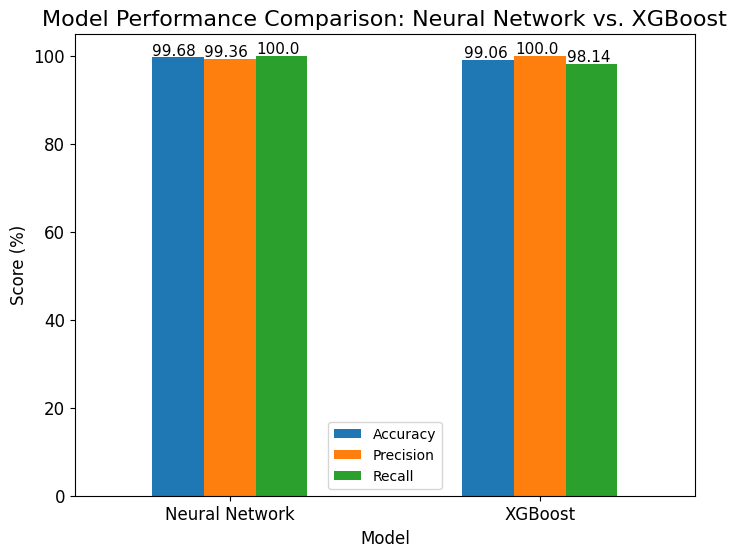
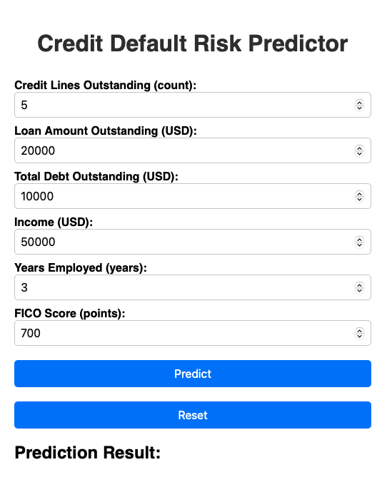

# JP Morgan Credit Default Prediction: Analysis & Web App

This repository contains a complete machine learning project designed to predict credit default risk, based on the JP Morgan Chase & Co. dataset from the Quantitative Research Virtual Internship (Task 3).

The project is presented in two parts:
1.  A detailed **Jupyter Notebook** showcasing the end-to-end process of model selection, tuning, and evaluation.
2.  An **interactive web application** built from the final, chosen model for real-time risk prediction.



---

## Business Problem

The goal of this project is to build a reliable model that can predict the probability of a customer defaulting on a credit payment. By accurately identifying high-risk applicants, a financial institution can minimize potential losses and make more informed lending decisions.

---

## Part 1: The Analysis - Model Selection & Tuning

Before building the final application, a rigorous analysis was conducted to find the best-performing model. This process is documented in a comprehensive Jupyter Notebook.

* **In-Depth Model Comparison:** The analysis directly compares the performance of a classic **XGBoost** model against a **Deep Learning** model built with TensorFlow/Keras.
* **Complete ML Workflow:** The notebook covers the entire data science lifecycle, including Exploratory Data Analysis (EDA), feature engineering, handling class imbalance, and hyperparameter tuning.

For a detailed walkthrough of this process, please see the notebook located in the `/analysis` folder:
* **[Model Selection and Tuning Notebook](Model-Selection/Credit_Default_Prediction_Model_Selection_v01.ipynb)**

---

## Part 2: The Result - Interactive Web App

The best-performing model from the analysis was then deployed into a user-friendly web application for real-time credit risk assessment.



---

## Skills & Technologies Demonstrated

* **Machine Learning:** XGBoost, Deep Learning (TensorFlow/Keras), Classification Models
* **Web Development:** FastAPI
* **Data Science:** Pandas, Scikit-learn, Matplotlib, Seaborn
* **MLOps:** Model Serialization (joblib), Dependency Management (requirements.txt), Docker

---

## How to Run the Web App

To run the final prediction app locally, clone the repository and install the required packages. The application is located in the `/app` folder.

```bash
# Clone this repository
git clone [https://github.com/your-username/jpmorgan-credit-default-app.git](https://github.com/your-username/jpmorgan-credit-default-app.git)
cd jpmorgan-credit-default-app

# Install dependencies
pip install -r requirements.txt

# Run the FastAPI server from the root directory
uvicorn app.main:app --reload
```

Once the server is running, you can access the web application by navigating to https://www.google.com/search?q=http://127.0.0.1:8000 in your web browser.
